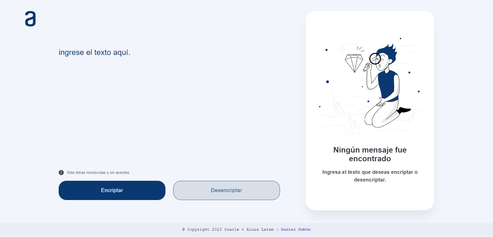

# 🚀 Challenge Encriptador de texto

# 📝 Descripción

Este desafío trata de realizar un encriptador utilizando las tecnologias de HTML, CSS Y JS.

Este encriptador nos permite encriptar textos y asi mismo poder desencriptarlos.

## 🛑 Restricciones

- Debe funcionar solo con letras minúsculas
- No deben ser utilizados letras con acentos ni caracteres especiales

     

## 📑 Ejemplo
### Encriptar
- ``"gato" => "gaitober"``

### Desencriptar
- ``gaitober" => "gato"``

# 🔒Método de Encriptación
##  Diccionario de encriptacion
| Clave | Reemplazo |
|-----------|-----------|
| e | enter |
| i | imes |
| a | ai |
| o | ober |
| u | ufat |

# 🔓Método de Desencriptación
| Clave | Reemplazo |
|-----------|-----------|
| enter | e |
| imes | i |
| ai | a |
| ober | o |
| ufat | u |
